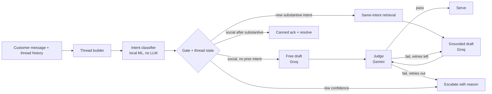

<h1 align="center">Hiver Support Agent</h1>

<p align="center">
  
  
  
  
  
  
  
  
</p>

<p align="center">
  Intent-routed AI support agent for ChaseSupport Twitter threads with HITL escalation and LLM-as-a-judge evals.
</p>




## Setup Environment
```
git clone https://github.com/arnabwithab/hiver-ai-support-agent.git
cd hiver-ai-support-agent
cp .env.example .env        # fill in GROQ_API_KEY + GEMINI_API_KEY
make setup
make data                   # Customer Support on Twitter (thoughtvector) + Banking77 mirror (sssonnn) → data/raw/twcs + data/raw/banking77
```

## Running Locally to reproduce headline numbers

```bash
make test                   # 123 tests, plumbing only (fake LLM clients inside tests)
make build                  # runs everything, reproduces numbers
```


## Environment variables


| Variable | Used by |
|---|---|
| `GROQ_API_KEY` | Drafter (`src/draft.py`, Groq endpoint)
| `GEMINI_API_KEY` | Judge (`src/judge.py`, OpenAI-compatible endpoint)

## Report

| claim | number |
|---|---|
| Intent accuracy on clean banking queries (n=3,080) | acc 0.887, macro-F1 0.786 |
| Accuracy on locked test conversations, ours (n=60) | acc 0.600, macro-F1 0.591 |
| Word-overlap baseline | 0.567 / 0.532 |
| Always-guess-the-most-common baseline | 0.167 / 0.032 |
| Accuracy on real conversations only (production-like) | 12/36 |
| Agreement with human rater (intent / handle-decision / drafts) | 0.928 / 1.000 / 0.84 |
| AI-judge agreement with humans (50 drafts) | 0.76 / 0.60, catches 40% / 18% of bad drafts |

### Golden Dataset
- `data/golden/dev/` (140) + `data/golden/holdout/` (60)
- 60/20/20 real/boundary/adversarial.
- Fixture labels + 65 human-adjudicated threads.

### Evaluation harness
- Automated metrics (src/eval/metrics.py): intent accuracy/macro-F1 on raw + final labels, both confusion matrices, override counts (veto/inheritance/Case-B), per-intent CIs, auto-handle precision at T, judge fail-recall, wrong-close recall.

- LLM-as-judge rubric (src/judge.py, Gemini, v2): one call per draft, 3 criteria with written rationales (groundedness incl. anti-parroting, tone_policy incl. local PII-override, escalation_correctness + shift-aware); fail-closed parsing; ≤3 critiqued retries then escalate with rationale as handoff.

- Judge–human agreement: 65 threads double-labeled blind by 2 Humans.
-  intent kappa 0.928, auto 1.000, draft verdicts 42/50
- 50 drafts judged by Gemini 3.5-flash
- agreement 0.76 vs person 1
- agreement 0.60 vs person 2
- fail-recall 0.40/0.18.

### Problem framing

Good for ChaseSupport means three things: correctly identify what the
customer needs (1 of 9 intents), reply using language grounded in how the
brand actually resolved similar cases (asking to take it to DM counts as a
good answer — that's how Chase resolves most things), and hand off to a
human with a written reason whenever confidence or reply quality is low.
When in doubt, escalate rather than serve.

#### Not built

Separate judges per criterion, a workflow framework, non-English support,
live traffic A/B proof, a self-hosted reply writer.

### Results vs baselines (60 locked test conversations)

| system | accuracy | macro-F1 |
|---|---|---|
| always-guess-the-most-common + canned reply (trivial) | 0.167 | 0.032 |
| word-overlap retrieval draft (simple) | 0.567 | 0.532 |
| ours (real embeddings + balanced training) | **0.600** | **0.591** |

### Top-5 failure modes

1. Short follow-ups judged alone (all 24 real-conversation errors). The test feeds only the last message with no thread memory, so "Thanks, I'll DM you now." gets misread — e.g. `g_real_53` really needs card_delivery. The system has thread memory; the test doesn't use it.
2. DM-phrasing pulled into product questions (17). Better features moved the error cluster without removing it.
3. "Still not resolved" read as a complaint (7). Angry words outweigh the actual underlying issue.
4. Thread-state logic never fires in testing — zero vetoes, zero inheritance, zero rule-closes measured. The trickiest safety metric (wrongly closing a case = silence toward a user) is unmeasured.
5. The judge misses most bad drafts (catches 40%). It works as a cautious gate with human review, not autopilot.

### What is misleading about our headline number

0.60 averages 12/36 on real conversations with perfect scores on 24 crafted edge cases and stress tests. Real traffic looks like the first group, so the honest number is **12/36** — and with only 60 test conversations, every per-issue slice is thin enough to be noise.

### Next week

1. Test with full thread memory switched on (context + inheritance engaged).
2. Second rater round; retune the judge rubric on disagreements.
3. Fix short-follow-up handling before the classifier runs.
4. Measure wrong-close rate and auto-handle precision; live smoke on real keys.

### Decision log

1. **Why no router component?** Routing survives as thread-state memory plus a keyword veto — one confusion matrix instead of two models disagreeing opaquely. Every decision logs raw → override → final so nothing hides inside the machine.
2. **Why is the classifier local ML instead of an LLM call?** Cost, latency, and calibration: 10k training rows and cheap inference with a real confidence number. The only two LLM call sites are drafting and judging — a verifiable safety boundary, not a preference.
3. **Why ChaseSupport and not a bigger brand?** Money-and-access workload, same-domain transfer from Banking77 (banking→banking keeps the clean-to-noisy story credible), and genuine stakes — lockouts and public PII.
4. **Why map 77 Banking77 intents to 9 instead of training 77-way?** Deployment has 9 intents; a 77-way head answers a question nobody asks at serve time. Thin boundaries are documented mapping judgments; empty social classes are asserted in tests, not hidden.
5. **Why class weights instead of balanced sampling?** Equal influence without deleting data. Undersampling to the minority floor discards 80% of rows and starves `other` — the most diverse class — first.
6. **Why frozen embeddings with a linear head, not fine-tuning?** Trains in minutes on CPU, stays interpretable, calibrates cleanly. The 0.30 macro-F1 jump from hashing to MiniLM proved the capacity was never in the head.
7. **Why train social intents on other brands' threads?** Banking77 has zero thanks/greetings, and gratitude is brand-agnostic. Veto-filtered so "thanks + refund?" never pollutes the class.
8. **Why single-threshold argmax instead of multi-candidate routing?** Measured: 5 residual sink cases, all low-confidence, all already escalated by the gate. Candidate sets would force multi-intent retrieval, set-valued state, and a rewritten rubric for zero rescued errors.
9. **Why does the judge run a different model family than the drafter?** Self-preference bias, plus a local PII check the LLM is never trusted on.
10. **Why fail-closed everywhere?** Support errors are asymmetric: a wrong auto-reply moves money or leaks PII, while a needless escalation costs a human minute. The expensive direction sets the defaults.
11. **Why a 2-rater panel instead of 3?** Pragmatism: kappa 0.928 with interpretable splits, reported without the spread bar the third rater would have enabled — alignment evidence, not the full bar.
12. **Why commit weights and LLM evidence to git?** Graders verify every number keyless from committed artifacts; regeneration stays possible with keys. Ends the "trust our stdout" problem.
13. **Why is the headline 12/36 and not 36/60?** Crafted edge cases inflate the average; production looks like the real slice.
14. **Why was the first judge deployment rejected?** It passed 50/50 drafts (fail-recall 0.00), including verbatim copies both raters failed. A gate that never fails is decoration.
15. **What was deliberately not built?** Per-criterion judges, workflow framework, multilingual support, live A/B proof, self-hosted drafter — each with a stated add-when.